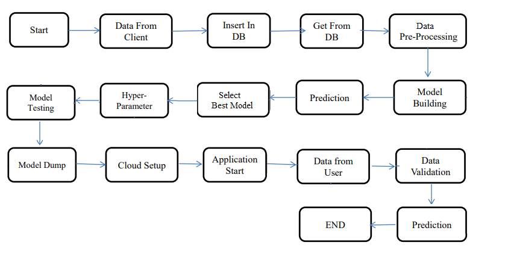
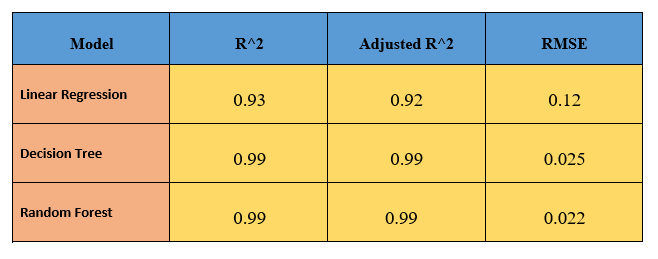
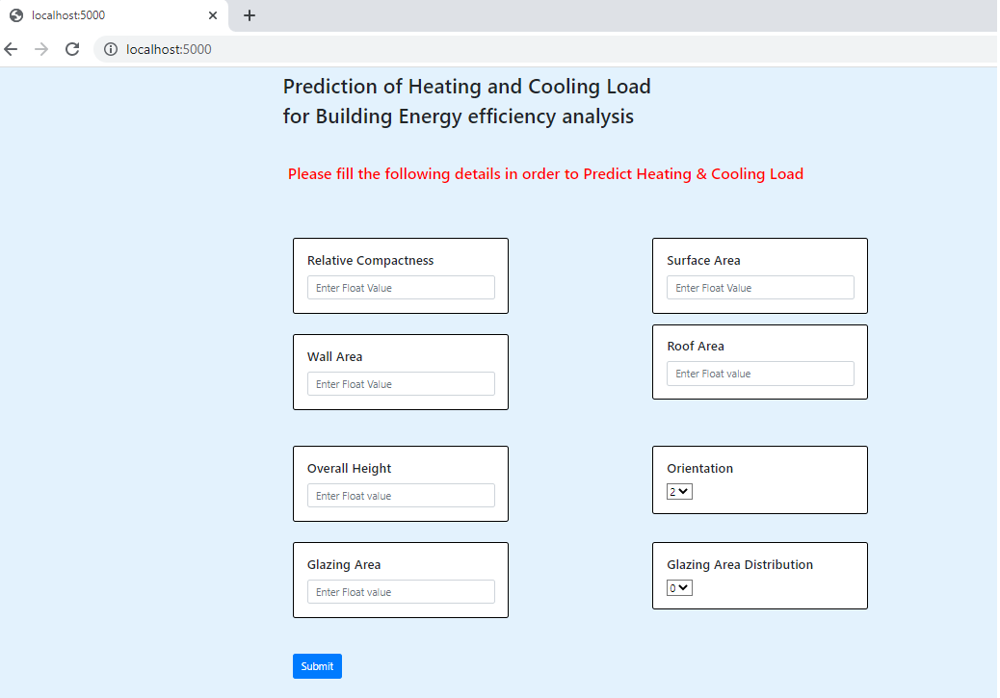

# Energy-Efficiency

## Table of Content
- Introduction
- Approach
- Model Workflow
- ML Model Perfomance Comparison & Model Selection.
- Web Application User Interface
- File Structure
- Installation
- Deployment Link
- Technology Used
- Document

## Introduction
When it comes to efficient building design, the computation of the heating load (HL) and the cooling load (CL)
is required to determine the specifications of the heating and cooling equipment needed to maintain comfortable 
indoor air conditions. In order to estimate the required cooling and heating capacities, architects and building 
desioners need information about the characteristics of the building and of the conditioned space (for example 
occupancy and activity level). For this reason, we will investigate the effect of eight input variables: (RC), 
surface area, wall area, roof area, overall height, orientation, glazing area, and glazing area distribution,
to determine the output variables HL and CL of residential buildings.

**Input Independent variables are:**
1. relative compactness
2. surface area
3. wall area
4. roof area
5. overall height
6. orientation
7. glazing area
8. glazing area distribution

**Output Dependent variables:**
1. heating loads
2. cooling loads

## Approach
~~~
1. Data Exploration     : Started exploring dataset using pandas,numpy,matplotlib and seaborn. 

2. Data visualization   : Ploted graphs to get insights about dependend and independed variables. 

3. Data Cleaning        : Check whether the data contain any missing values and Outliers.

4. EDA Analysis         : EDA Analysis with Summary Table, Histogram, Density Plots, Scatter Plots,correlation matrix.

3. Feature Selection    : Few features are highly correlated, but we not ignore it, because it is a small dataset.

4. Data Transformation  : Log transformation on heating load and cooling load to make them more normalised in term 
                          of distribution.

5. Model Selection      : Train Multiple Linear Regression Model, Decision Tree Regression, Random Forest Regressio models.
                          Test all trained models to check the R^2, Adjusted R^2 and RMSE value, and select low RMSE value model.
                       
7. Pickle File          :  Selected model as per best RMSE value and created pickle file using Python pickle module.

8. Webpage & deployment :  1. Created a webform that takes all the necessary inputs from user and shows output.
                           2. After that I have deployed project on AWS Elastic Beanstalk.
~~~

## Model Workflow

## ML Model Perfomance Comparison & Model Selection.

Select Random Forest model as best model, because it have very low RMSE value.

## Web Application User Interface

 

## File Structure
~~~
Project
|
|
Database Coonection--|
|                    |--Database.py
|                            
|                            
Dataset--------------|
|                    |---ENB2012_data.csv
|                    |---ENB2012_data.xlsx
|                    
|
|logFiles-----------|--App.log
|                   |--database.log
|                   |--Export & Import.log
|
Static--------------|
|                   |--css--|
|                   |       |---style.css
|                   |
|                   |--script--|
|                   |          |--script.js
|                   
templates-----------|  
|                   |---index.html
|                   |---Reoprt.html
|
|venv
|
|app.py
|
|Procfile
|
|requirements.txt
|
|runtime.txt
|
|secure-coonect-energyefficiency.zip
~~~

## Installtion
The Code is written in Python 3.7.11. If you don't have Python installed you can find it [your link here](https://www.python.org/downloads/). If you are using a lower version of Python you can upgrade using the pip package, ensuring you have the latest version of pip. To install the required packages and libraries, run this command in the project directory after [cloning](https://docs.github.com/en/github/creating-cloning-and-archiving-repositories/cloning-a-repository) the repository.

~~~
Create a Virtual Env with conda create "Your Env name"
~~~
~~~
pip install -r requirements.txt
~~~
~~~
Run aap.py file
~~~

## Deployment Link

AWS Link : 

AWS Link For Data Report :

## Technology Used
~~~
1. Python
2. Sklearn
3. Pandas
4. Numpy
5. Flask
6. HTML
7. CSS
8. JS
9. Cassendra
10. AWS
~~~

## Document
Below providing the link of all the document that are required for creating the project.

Link: [Document Link](https://drive.google.com/drive/folders/1K_HT4_xuIIuqn0l-AVdhjAgKJY8VHhkX?usp=sharing)

